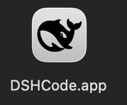

# DSHCode

English | [中文](README.zh.md)

DSHCode is a community-maintained Electron desktop companion for the official open-source [DeepSeek Harness](https://github.com/deepseek-ai/deepseek-harness) project. It packages the upstream Web UI and plugin runtime as a one-click macOS and Windows application, so installed users do not need Node.js or a CLI.

<p align="center"></p>

<p align="center"> </p>

## Run

Install a DSHCode package, then open `DSHCode` from the macOS Applications folder or Windows Start menu. The application starts and stops its bundled Web profile itself; installed users do not run a terminal command.

### Run from source

Developers can still run the upstream Web entry from a repository checkout:

```sh
git clone https://github.com/whitelonng/dshcode.git
cd dshcode
pnpm install
pnpm run build
pnpm dsh web
```

The command prints the local Web UI address. See the [Web UI guide](docs/user/guide/index.md).

## Desktop application

Opening DSHCode starts the bundled Harness Web profile and displays it in a hardened Electron window. The desktop shell is intentionally small; product behavior and the Web UI remain in the upstream packages so later upstream updates can be integrated without maintaining a second interface.

See the [desktop application guide](apps/desktop/README.md) for architecture, platform targets, packaging, and current limitations.

### Local service and ports

Each application launch starts an HTTP service inside the Electron main process. It binds only to `127.0.0.1` and asks the operating system for an available ephemeral port, so it does not reserve a fixed port or normally conflict with another local service. DSHCode permits one application instance, loads only its exact loopback origin, and disposes the Harness tree before the process exits; closing the application therefore stops the service and releases its port.

### Build desktop packages

```sh
git clone https://github.com/whitelonng/dshcode.git
cd dshcode
pnpm install
pnpm run desktop:dist
```

Artifacts are written to `.artifacts/desktop/release/`. The repository also contains a manual/tag-triggered GitHub Actions workflow for macOS Apple Silicon, macOS Intel, and Windows x64 packages.

## Project positioning

DeepSeek Harness (`dsh`) is the official open-source plugin-based agent harness developed by [DeepSeek AI](https://deepseek.com). DSHCode participates in its plugin ecosystem as a desktop companion distribution and uses the `dsh-plugin` and `deepseekharness-plugin` repository topics for discovery. It retains the upstream package names, copyright notices, architecture, documentation, and `upstream` Git remote so changes remain attributable and mergeable.

DSHCode is an independent community project. Unless DeepSeek grants explicit authorization, it is not an official DeepSeek release, endorsement, or certification.

## Development

Start with the [development guide](docs/development.md), [architecture documentation](docs/architecture.md), and [desktop application guide](apps/desktop/README.md). For agents, follow [AGENTS.md](AGENTS.md).

## License and branding

The source remains available under the upstream [MIT License](LICENSE). Redistribution must retain DeepSeek's copyright and permission notice; bundled third-party software and licenses are disclosed in [THIRD_PARTY_NOTICES.md](THIRD_PARTY_NOTICES.md), and the desktop package includes both files.

The MIT software license does not by itself grant permission to use DeepSeek trademarks or logos as DSHCode branding. DeepSeek's [Terms of Use](https://cdn.deepseek.com/policies/en-US/deepseek-terms-of-use.html) ([Chinese version](https://cdn.deepseek.com/policies/zh-CN/deepseek-terms-of-use.html)) reserve those brand features. The screenshots and current preview icon identify compatibility with the upstream interface, not endorsement; obtain written permission or replace DeepSeek brand assets before distributing branded binaries.
