# DSHCode

[English](README.zh.md) | 中文

DSHCode 是一款面向 macOS 和 Windows 的免费开源桌面 AI Agent 应用。它将 DeepSeek 官方开源项目 [DeepSeek Harness](https://github.com/deepseek-ai/deepseek-harness) 的 Web UI 与插件运行时打包成一个可直接安装的 Electron 应用——无需 Node.js、无需终端、无需命令行。

<p align="center"><a href="https://github.com/whitelonng/dshcode/releases"></a> <a href="LICENSE"></a> <a href="https://github.com/whitelonng/dshcode/releases"></a> <a href="https://github.com/whitelonng/dshcode/releases"></a> <a href="https://github.com/deepseek-ai/deepseek-harness"></a></p>

<p align="center">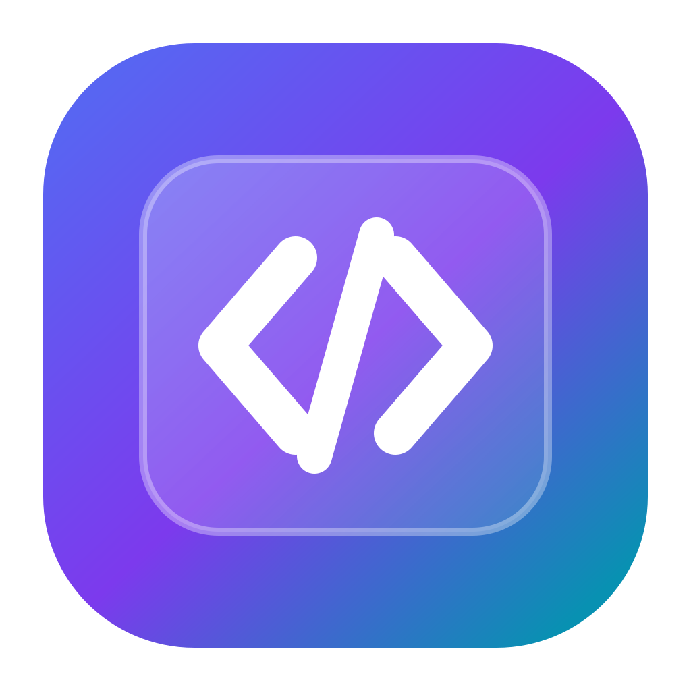</p>

<p align="center">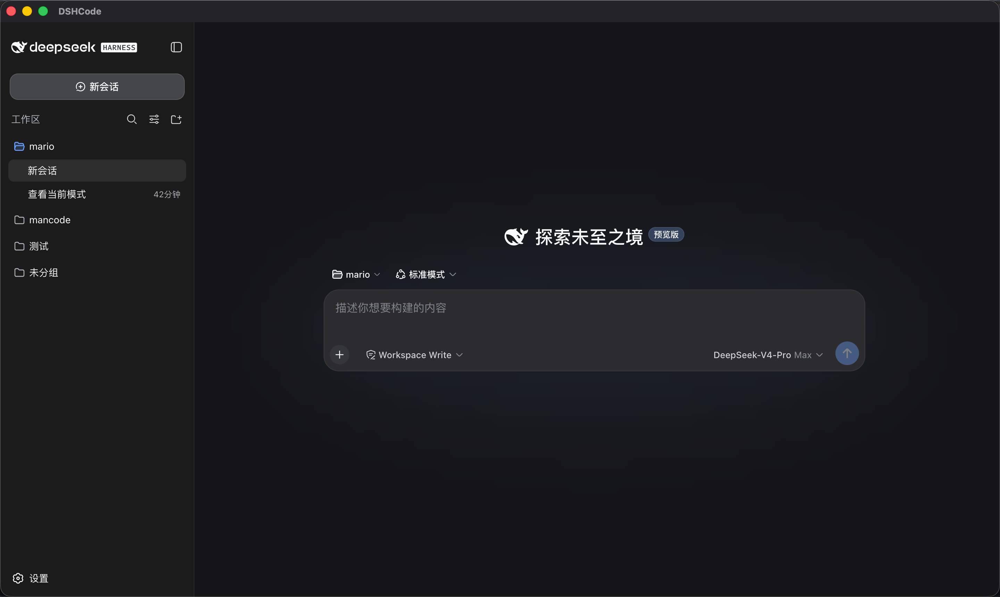 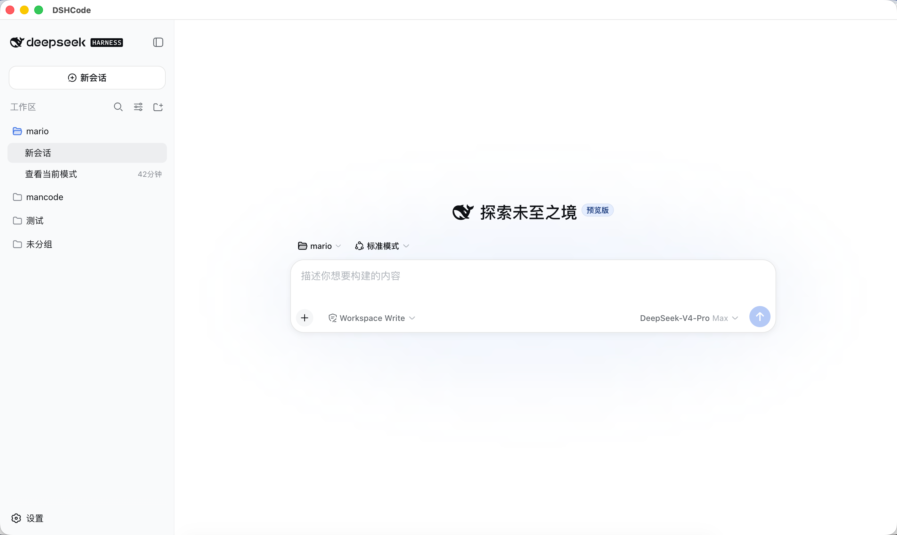</p>

## 功能特性

DSHCode 继承了 DeepSeek Harness 的完整能力，并加上了开箱即用的桌面体验。

**Agent 核心** — 插件化框架，内置 bash、文件系统、网页搜索/抓取、终端、LSP 与子进程工具；支持沙箱隔离与逐操作审批提示。

**交互式 UI** — 内联渲染的 GenUI 卡片：图表、表格、测验、3D 场景、示意图、表单与进度视图。

**Skills 技能** — 可安装的技能目录，为 Agent 提供专项工作流——研究、文档写作、视觉工具等。

**编排能力** — Subagent 并行委派，以及可跨多个 Agent 分阶段并行展开的 Workflow。

**长任务** — 执行前先审查再批准的 Plan 模式、跨轮次持续进行的 Goal 目标、可恢复的会话。

**模型体验** — 通过官方 API 使用 DeepSeek 模型；会话日志完整记录模型所见内容，任何一次运行都可被重建。

**模型控制** — 按供应商调节推理强度（关闭到最高）、最大输出 token 数，以及图像输入、图像生成与图像识别等多模态能力开关。

<p align="center">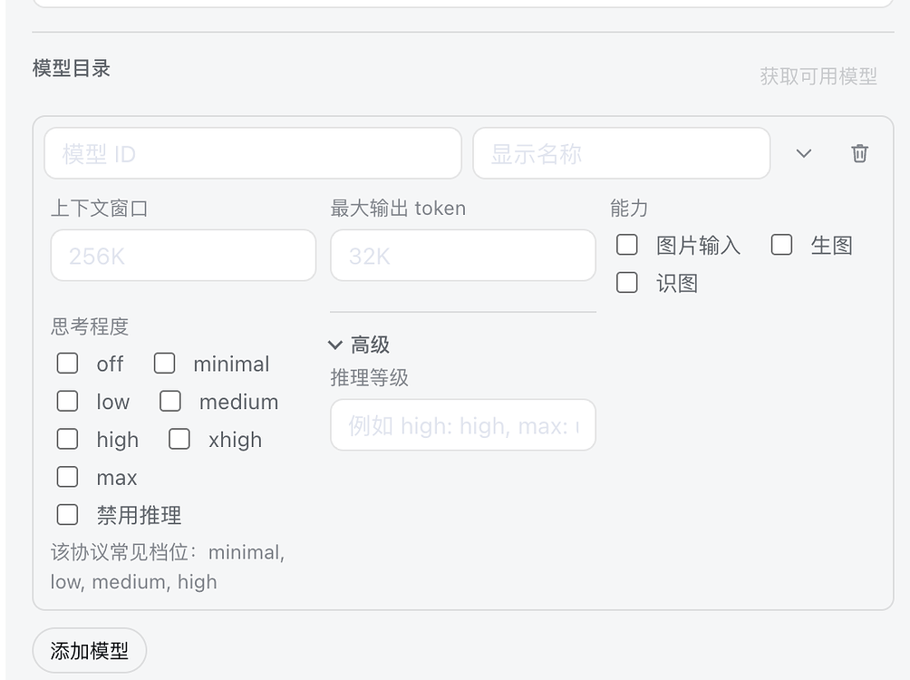 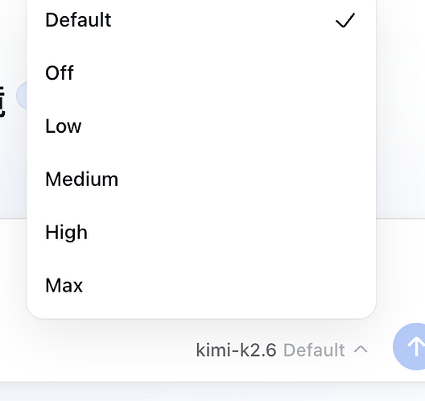</p>

**个性化** — 主题与皮肤合集、选区批注工作流、命令快捷键、中英双语界面。

**插件管理** — 从 npm 或 Git 仓库安装插件、检查更新，并可逐个启用或禁用。

<p align="center">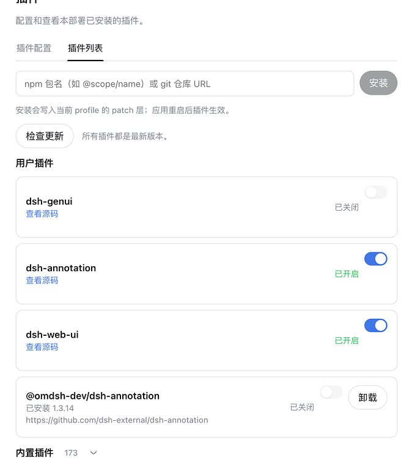</p>

**故障恢复** — 加载失败的插件会连同诊断信息一起报告：可禁用该插件、以安全模式启动，或让 Agent 携带失败上下文自动修复。

<p align="center">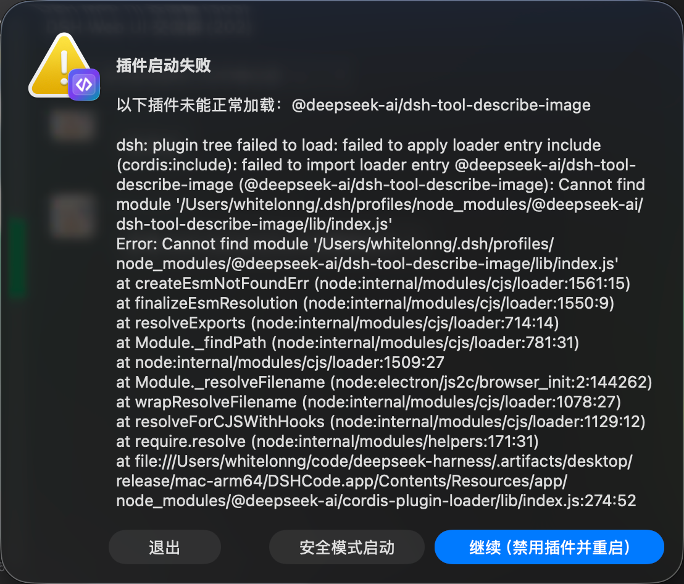 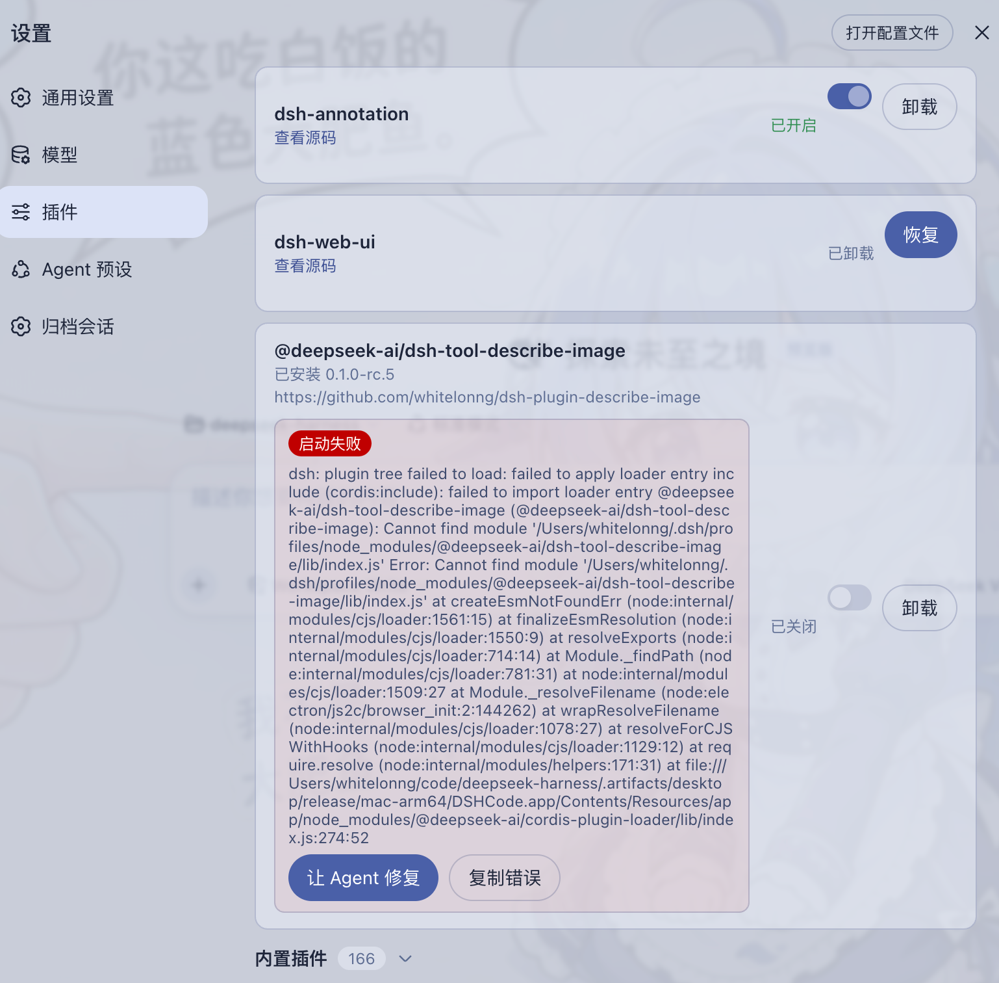</p>

<p align="center">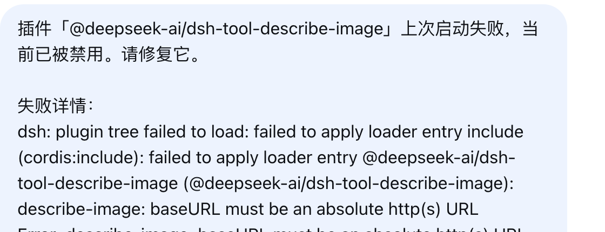</p>

**归档管理** — 搜索已归档会话，可恢复或彻底删除。

<p align="center">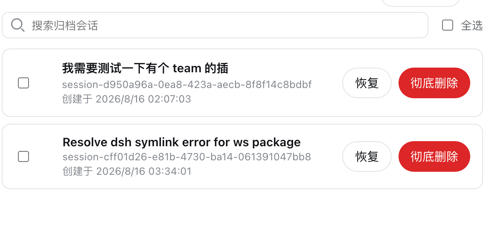</p>

**可扩展** — 安装新能力无需改动应用本体。

**桌面集成** — 托盘图标、系统通知、单实例运行、加固的 Electron 窗口。

<p align="center">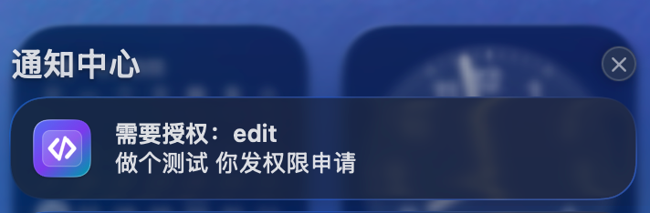</p>

详见 [Web UI 指南](docs/user/guide/index.md) 的操作讲解，以及[桌面应用指南](apps/desktop/README.md)中的架构、平台目标与当前限制。

## 下载

| 平台 | 安装包 |
|---|---|
| macOS Apple Silicon | [DSHCode-*-macos-arm64.dmg](https://github.com/whitelonng/dshcode/releases) |
| macOS Intel | [DSHCode-*-macos-x64.dmg](https://github.com/whitelonng/dshcode/releases) |
| Windows x64 | [DSHCode-*-win-x64.exe](https://github.com/whitelonng/dshcode/releases) |

每个版本都会随安装包发布 SHA-256 校验和（`SHA256SUMS.txt`）。

预览版安装包尚未进行代码签名或公证，因此 macOS Gatekeeper 与 Windows SmartScreen 可能在首次启动前发出警告。软件本身是安全的；警告只是因为二进制文件缺少付费签名证书：

- **macOS**：在访达中右键点击应用并选择**打开**，然后在弹窗中确认。或者在终端执行一次 `xattr -cr /Applications/DSHCode.app`。
- **Windows**：在 SmartScreen 弹窗中点击**更多信息**，然后选择**仍要运行**。

## 快速开始

安装 DSHCode 安装包后，从 macOS“应用程序”文件夹或 Windows“开始”菜单打开 `DSHCode`。应用会自行启动和停止内置 Web profile；安装版用户无需运行终端命令。

### 从源码运行

开发者仍可从仓库源码运行上游 Web 入口：

```sh
git clone https://github.com/whitelonng/dshcode.git
cd dshcode
pnpm install
pnpm run build
pnpm dsh web
```

命令会打印本地 Web UI 地址。详见 [Web UI 指南](docs/user/guide/index.md)。

## 桌面应用

打开 DSHCode 时，应用会启动内置的 Harness Web profile，并在经过安全加固的 Electron 窗口中显示。桌面外壳刻意保持精简；产品行为和 Web UI 仍由上游包提供，因此后续可以继续集成上游更新，而不必维护第二套界面。

### 本地服务与端口

应用每次启动时都会在 Electron 主进程内启动一个 HTTP 服务。该服务只绑定 `127.0.0.1`，并让操作系统分配一个可用的临时端口，因此不会占用固定端口，通常也不会与其他本地服务冲突。DSHCode 只允许一个应用实例，只加载其自身的精确回环地址；进程退出前会先释放 Harness 树，所以关闭应用也会停止服务并释放端口。

### 构建桌面安装包

```sh
git clone https://github.com/whitelonng/dshcode.git
cd dshcode
pnpm install
pnpm run desktop:dist
```

构建产物写入 `.artifacts/desktop/release/`。名为 `Desktop` 的 GitHub Actions 工作流会构建 macOS Apple Silicon、macOS Intel 和 Windows x64 安装包；`desktop-v*` tag 会把完整构建矩阵及 SHA-256 校验和发布到 GitHub Releases。

## 常见问题

**DSHCode 是什么？**

DSHCode 是一款免费、开源的桌面应用，把 DeepSeek 的插件化 AI Agent 框架 DeepSeek Harness 变成可直接安装的 macOS 与 Windows 应用，并提供图形化的对话与工作区界面。

**DSHCode 是 DeepSeek 官方软件吗？**

不是。DSHCode 是独立的社区项目。它保留上游包名、版权、架构、文档和 `upstream` Git 远程地址，以便正确归属来源并继续合并上游变更；但除非 DeepSeek 明确授权，它不代表 DeepSeek 官方发行、背书或认证。

**需要 Node.js 或终端吗？**

不需要。安装版用户得到的是普通应用；Node.js、CLI 与终端只在从源码运行或自行构建安装包时才需要。

**为什么 macOS/Windows 会弹出安全警告？**

预览版安装包尚未进行代码签名或公证。这是签名证书的成本问题，不是安全问题；一次性打开步骤见下载一节。

**需要 API Key 吗？**

需要。DSHCode 通过官方 API 运行 DeepSeek 模型；在应用设置中配置一次即可。

**DSHCode 可以扩展吗？**

可以。内置插件安装器可在不改动应用本体的前提下添加新能力；安全模式可以禁用导致崩溃的插件，保证应用仍能正常启动。

## 项目定位

DeepSeek Harness（`dsh`）是由 [DeepSeek AI](https://deepseek.com) 开发的官方开源插件式 agent harness（智能体框架）。DSHCode 作为桌面端配套发行版参与其插件生态，并使用 `dsh-plugin` 和 `deepseekharness-plugin` 仓库标签便于检索。

DSHCode 是独立的社区项目。除非 DeepSeek 明确授权，否则它不代表 DeepSeek 官方发行、背书或认证。

## 开发

请先阅读[开发指南](docs/development.md)、[架构文档](docs/architecture.md)和[桌面应用指南](apps/desktop/README.md)。面向 agent：请遵循 [AGENTS.md](AGENTS.md)。

## 致谢

- [LINUX DO](https://linux.do) — 本项目也在 LINUX DO 社区持续分享与交流。
- [dsh-genui](https://github.com/omdsh-dev/dsh-genui) — 为内置生成式 UI 能力提供插件实现。
- [dsh-annotation](https://github.com/omdsh-dev/dsh-annotation) — 为内置文本批注流程提供插件实现。
- [dsh-web-ui](https://github.com/zhu1090093659/dsh-web-ui) — 为内置 Web UI 功能与皮肤集合提供插件实现。

## 许可证与品牌

源码继续使用上游 [MIT 许可证](LICENSE)。再次分发时必须保留 DeepSeek 的版权与许可声明；内置第三方软件及其许可证见 [THIRD_PARTY_NOTICES.md](THIRD_PARTY_NOTICES.md)，桌面安装包会同时附带这两个文件。

MIT 软件许可证本身不等于获得 DeepSeek 商标或 Logo 的 DSHCode 品牌使用许可。DeepSeek 的[用户协议](https://cdn.deepseek.com/policies/en-US/deepseek-terms-of-use.html)（[中文版](https://cdn.deepseek.com/policies/zh-CN/deepseek-terms-of-use.html)）保留了这些品牌标识的相关权利。DSHCode 发行版使用独立应用图标；内嵌 Harness 界面保留的上游身份标识及官方 `powered by dsh` 署名只用于说明兼容关系，不代表官方背书。
